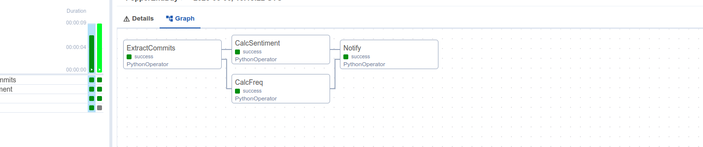
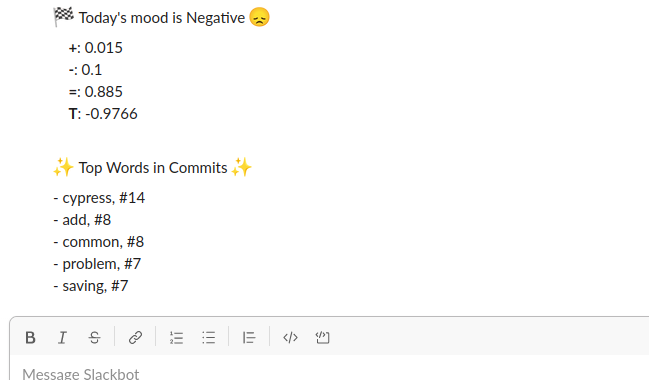

**Airflow playground**

[Apache Airflow](https://airflow.apache.org/)

**Install/Run the experiment** 

`docker compose up airflow-init`

`docker compose up`

**Usage** 

`http://0.0.0.0:8080/dags/GitlabEndDay/grid/`

Credentials `airflow` / `airflow`

**Workflow**

*GitlabEndDay* - extracts commits except merges form a Gitlab project repo,
calculates sentiment score based on the messages and top words found in commits
& sends a Slack notification

Result

